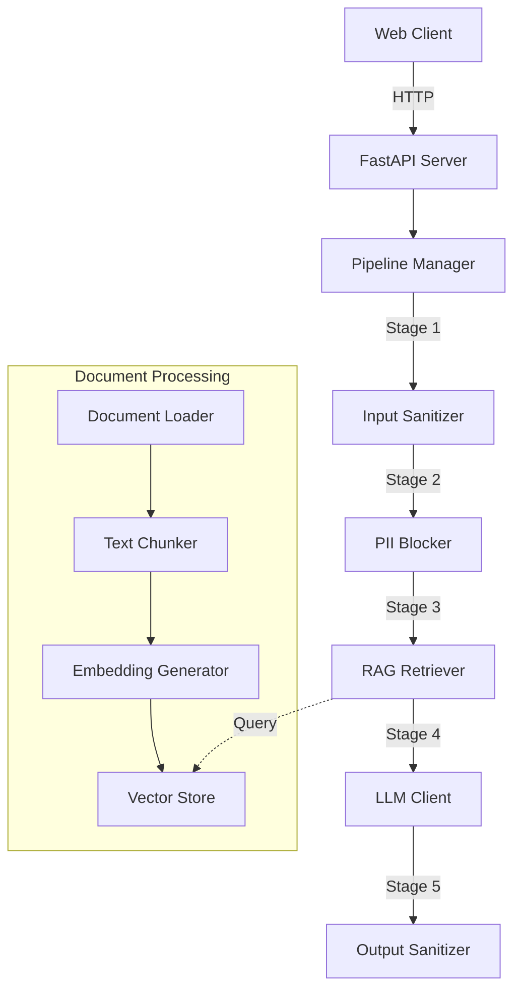

# RagsWorth Documentation

Welcome to the RagsWorth documentation! RagsWorth is a production-ready, secure, and embeddable AI chatbot with Retrieval-Augmented Generation (RAG) capabilities. Built with Python, it supports multiple LLM providers and includes robust PII protection.

## Key Features

- 🤖 Multi-Provider LLM Support (OpenAI, Anthropic, Ollama)
- 📚 RAG with document ingestion (PDF, Markdown, HTML, Text)
- 💾 Multiple Vector Database Backends (FAISS, Milvus)
- 🔒 PII Detection and Protection Pipeline
- 🔌 Easy Website Integration via JavaScript Widget
- 🛠️ Plugin Architecture for Custom Processing Steps
- 📊 Source Attribution for Generated Responses
- 🐳 Docker Support for Easy Deployment

## Quick Start Guide

### Prerequisites

- Python 3.8+
- [uv](https://github.com/astral-sh/uv) (recommended) or pip
- [Ollama](https://ollama.ai/) (if using Ollama provider)
- Docker (optional, for containerized deployment)

### Installation

1. Clone the repository:
```bash
git clone https://github.com/yourusername/ragsworth.git
cd ragsworth
```

2. Create and activate a virtual environment:
```bash
uv venv
source .venv/bin/activate
```

3. Install the package:
```bash
uv pip install -e .
```

4. Set up environment variables:
```bash
cp .env.example .env
# Edit .env with your API keys (not needed for Ollama)
```

### Running RagsWorth

1. If using Ollama, pull required models:
```bash
# For chat completion
ollama pull gemma:2b

# For embeddings
ollama pull nomic-embed-text
```

2. Start the server:
```bash
uvicorn ragsworth.api:app --reload
```

3. Load some test documents:
```bash
# Create test documents directory
mkdir test_docs
# Add your documents (PDF, MD, TXT, HTML)
python scripts/load_documents.py test_docs
```

4. Embed in your website:
```html
<script src="http://localhost:8000/static/widget.js"></script>
<div id="ragsworth-chat"></div>
<script>
  new RagsWorth({
    endpoint: 'http://localhost:8000',
    containerId: 'ragsworth-chat',
    theme: {
      primary: '#007bff',
      secondary: '#6c757d',
      background: '#ffffff',
      text: '#212529'
    }
  });
</script>
```

## Documentation Structure

- [Configuration Guide](./configuration.md) - Detailed configuration options
- [Vector Database Integration](./vector-db.md) - Setting up and using vector databases
- [Embedding Models](./embedding-models.md) - Supported models and configuration
- [PII Protection](./pii-protection.md) - Privacy and security features
- [API Reference](./api/README.md) - Detailed API documentation
- [Troubleshooting](./troubleshooting.md) - Common issues and solutions
- [FAQ](./faq.md) - Frequently asked questions

## Architecture



## Contributing

We welcome contributions! Please see our [Contributing Guide](./contributing.md) for details.

## License

RagsWorth is licensed under the MIT License. See the [LICENSE](../LICENSE) file for details. 